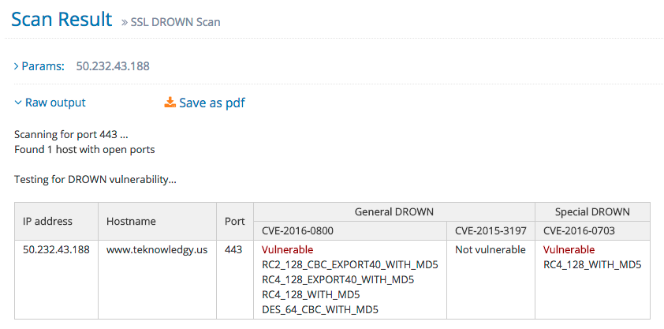

## OpenSSL Drown跨协议攻击TLS漏洞

在线扫描结果演示:

## poc

* [github public_drown_scanner](https://github.com/nimia/public_drown_scanner/blob/master/scanner.py)

### local poc

* openssl_drown_scan.py

socket发送原始数据, 实现发送HELLO消息并验证SSLv2和TLS

* openssl_drown.py

pocsuite封装openssl_drown_scan.py
