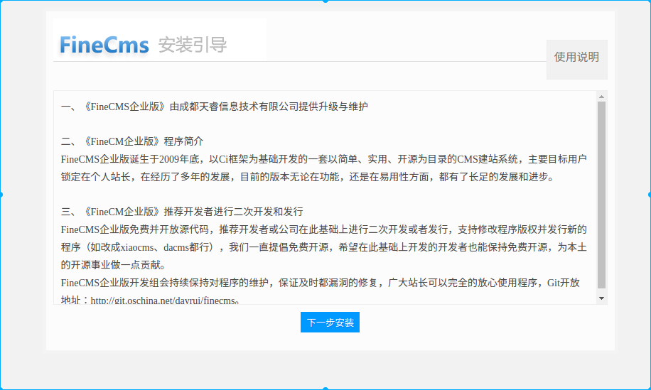
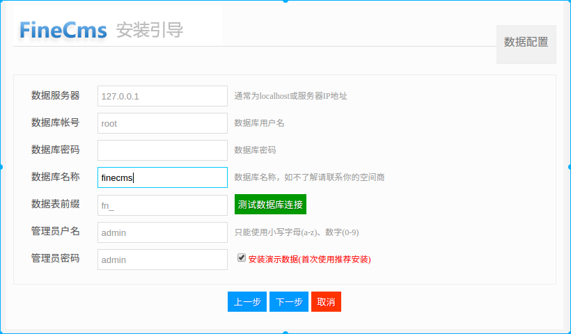

## info

FineCMS 任意文件上传

| app | version | vuln |
| --- | ------ | ----- |
| finecms | 2.1.0 | file upload |

## detail

`ajaxswfuploadAction` 函数过滤不严, 导致任意文件上传漏洞

```php
/**
* Swf上传
*/
public function ajaxswfuploadAction() {
    if ($this->post('submit')) {
        $_type = explode(',', $this->post('type'));
        if (empty($_type)) {
            exit('0,' . lang('att-6'));
        }
        $size = (int)$this->post('size');
        if (empty($size)) {
            exit('0,' . lang('att-5'));
        }
        $data = $this->upload('Filedata', $_type, $size, null, null, $this->post('admin'), 'swf', null, $this->post('document'));
        if ($data['result']) {
            exit('0,' . $data['result']);
        }
        //唯一ID,文件全路径,扩展名,文件名称
        exit(time() . rand(0, 999) . ',' . $data['path'] . ',' . $data['ext'] . ',' . str_replace('|', '_', $data['file']));
    } else {
        exit('0,' . lang('att-4'));
    }
}
```

post 请求 `type` 参数未过滤, 表示上传文件类型, 作为上传文件的后缀名。`upload` 函数做了黑名单过滤，如下：

```php
$ext = $upload->fileext();
if (stripos($ext, 'php') !== FALSE
    || stripos($ext, 'asp') !== FALSE
    || stripos($ext, 'aspx') !== FALSE
    ) {
    return array('result' => '文件格式被系统禁止');
```

仅做了基本过滤，过滤不严。

## docker env

* manual build 

```
docker build -t finecms210_file_upload .
docker run --name finecms210_file_upload -p 8000:80 finecms_file_upload
```

visit [http://127.0.0.1:8000/index.php](http://127.0.0.1:8000/index.php)





保持如上配置(可更改管理员帐号和密码), 数据服务器不能是`localhost`, 安装。

* dockerhub

you also fetch the env in dockerhub: `docker pull janes/finecms210_file_upload`, 管理员账户密码等，如上图所示

## poc

* manual check

visit [http://127.0.0.1:8000/upload.html](http://127.0.0.1:8000/upload.html), then `uplaod 123.phtml` file.

* python

```
python poc.py
```

## apache unsafe config will getshell

apache 解析多种文件后缀为 php 时，可以 getshell, 如： `/etc/apache2/mods-enabled/php5.6.conf`, 上传 `xxx.phtml`, 将作为php解析。

```
<FilesMatch ".+\.ph(p[3457]?|t|tml)$">
    SetHandler application/x-httpd-php
</FilesMatch>
<FilesMatch ".+\.phps$">
    SetHandler application/x-httpd-php-source
    # Deny access to raw php sources by default
    # To re-enable it's recommended to enable access to the files
    # only in specific virtual host or directory
    Require all denied
</FilesMatch>
# Deny access to files without filename (e.g. '.php')
<FilesMatch "^\.ph(p[3457]?|t|tml|ps)$">
    Require all denied
</FilesMatch>

# Running PHP scripts in user directories is disabled by default
# 
# To re-enable PHP in user directories comment the following lines
# (from <IfModule ...> to </IfModule>.) Do NOT set it to On as it
# prevents .htaccess files from disabling it.
<IfModule mod_userdir.c>
    <Directory /home/*/public_html>
        php_admin_flag engine Off
    </Directory>
</IfModule>
```

在上述docker 容器中，`/etc/apache2/conf.d/php5-module.conf` 文件添加如下行

```
AddHandler application/x-httpd-php .phtml
```

重启apache.

## 防御

* 上传文件类型过滤

* 增强访问控制，禁止未授权访问